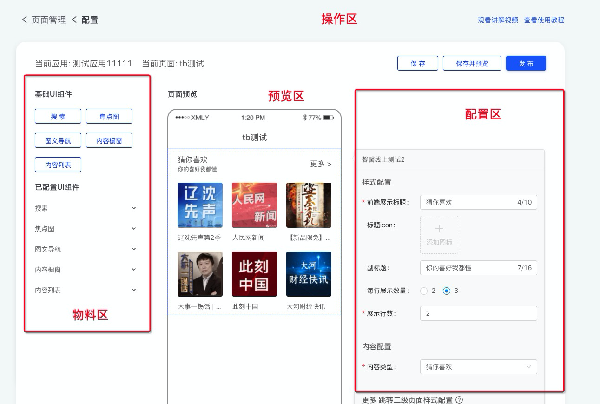

# 可视化页面编辑器的架构设计

## 前言

前不久开发历时半年的可视化搭建项目终于上线[手动撒花 🌹🌹🌹]，产品功能上和市面上常见的可视化编辑器其实并没有很大区别，功能细节处略有不同而已。本文主要是记录开发过程中遇到的问题以及解决思路。

**产品演示图**


## 需求分析

前期的准备工作还是比较重要的, 尤其是前端项目, 如果整个项目搭建好之后发现某个功能交互逻辑实现起来异常困难, 工作量大概率要成倍增加。哎，就不多说了，懂得都懂。



1. 物料区, 目前支持 5 种组件, 要求可复用, 可支持扩展
2. 可视化拖拽, 物料区拖拽至预览区, 预览区页面内部拖拽排序,
3. 预览区，流式排版, 点击可打开组件配置, 跟随组件位置
4. 实时预览, 即配置改动需要立马反映到预览区
5. 配置区, 大量调用业务相关的弹窗功能
6. 配置区, 需要实现自定义校验逻辑, 并支持单独保存

## 技术栈

系统使用到技术栈如下

`react` `typescript` `mobx` `scss` `antd`

## 数据结构定义

第一步当然是和找后端小哥定义接口页面存储的数据结构, 这部分应该没什么争议。

```ts
interface Page {
  id: number // 页面id
  siteName: string // 页面名称
  description: string // 描述
  createdAt: number // 创建时间
  operatorName: string // 操作人名称
  modules: [
    // 页面组件配置
    {
      id: number // 组件id
      name: string // 组件名称
      type: number // 组件类型
      configuration: JSON.stringify({ // 序列化后的配置, 以内容列表为例
        displayRowNum: 8,
        subPageConfiguration: {...},
        title: "暖心夜话",
        contentType: 3,
        columnId: 6747,
        columnName: "99%的成年人都会患上的情绪综合症，你中枪了么",
      }
      status: number // 上架状态
    }
  ]
}
```

具体使用时只需要按顺序解析 modules 字段中的 configration 配置展示即可, 编辑过后再按原有的数据结构回传回后端。注意这里有很多组件配置字段仅存储了索引关系, 具体展示信息仍需要运行时获取。

## 目录结构

```bash
├── @types # 声明文件
├── store  # 数据相关操作, 统一集中在这里
├── constant # 常量相关
├── service # 远程服务
├── common # 调用的相关组件
├── Editor # 编辑器
│   ├── BasicModules  # 基础组件区
│   ├── Empty # 空数据
│   ├── FormContainer # 配置区
│   ├── PreviewComponent # 预览组件
│   ├── PreviewContainer # 预览区
│   ├── UIModules # 扩展组件区
│   ├── index.tsx
├── Modules # 编辑器组件, 以List组件为例
│   ├── List
│   ├── ├── index.tsx # 渲染组件
│   ├── ├── Form.tsx # 表单组件
│   └── index.ts
```

## 组件

组价设计是这个系统中最重要的部分, 所有的操作都是通过组件解耦串联到一起, 并且串联到一起的

### 数据结构

下面是运行时需要用到的数据结构, 我们将后端给到的 configration 封装在了 data 中, 并扩展了一些字段, 比如 UI 状态和校验属性等。

```ts
interface CmsModule {
  id: number // uuid
  name: string // 组件名称
  component: any // 展示组件
  form: any // 表单组件
  type: number // 组件类型
  selected: boolean // 是否选中
  error: boolean // 是否有错误
  untouched?: boolean // 是否是初始化状态, 只有新增的组件会有此状态
  data: { id?: number } & Record<string, any> // 组件的configration
}
```

### 初始化

初始化的操作统一在 store 中编写, 下面是代码示例, 解析服务端数据生成本地模型

```ts
import { BASIC_MODULE_LIST } from 'Modules'
// modules是后端传入的数据结构
store.deserialize = (modules) => {
  this.value = modules.map((module) => {
    // 根据类型筛选出静态属性
    const staticInfo = BASIC_MODULE_LIST.find(
      (item) => item.type === module.type
    )
    const component: CmsModule = {
      ...staticInfo,
      id: module.id,
      type: module.type,
      name: module.name,
      selected: false,
      error: false,
      data: {
        id: module.id,
        ...(() => {
          try {
            return JSON.parse(module.configuration)
          } catch (e) {}
        })(),
      },
    }
    return component
  })
}
```

### 组件注册

上述代码中的`BASIC_MODULE_LIST` 相当于一个组件的注册列表, 通过 `BASIC_MODULE_LIST` 我们将组件的静态属性注入到运行时中, 同理新增一个组件也只需要添加如下条件即可。 当然如果你希望使用远程组件也都是可以的

```ts
import Search from './Search'
import SearchForm from './Search/Form'
export const BASIC_MODULE_LIST = [
  {
    type: 20,
    component: Search,
    name: '搜索',
    form: SearchForm,
  },
]
```

```ts
 // 加载远程组件, 可采用 require.js 加载或者直接加载
init() {
    const script = document.createElement('script')
    script.src = 'https://demo.umd.component.js'
    script.onload = () => {
        BASIC_MODULE_LIST.push([
            {
            type: 31,
            component: window.Search,
            name: '远程组件示例',
            form: window.Search.Form,
            },
        ])
    }
    document.body.appendChild(sciprt)
}
```

最后来看一下我们是如何使用组件的数据的

**PreviewComponent.tsx**

```tsx
    render() {
        const Module = module.component
        const Form = module.form
        return <div
        className={classnames(
          style.preview,
          module.selected && style.selected,
          module.error && style.error
        )}
        onClick={this.handleSelect}>
            <span className={style.component}>
                {<Module {...module.data} />}
            </span>
            {data.selected && <FormContainer  data={...module.data} Form={module.form}>
                <div className={style.title}>{module.name}</div>
            </FormContainer>}
        </div>
    }
```

## 配置

### 组件的配置

先来聊聊组件的配置, 回顾一下需求, 组件的配置需要支持实时错误校验, 调用业务资源相关的弹窗, 以及单独保存。当然最重要的需要实现控制反转, 也就是说配置文件只描述表单规则, 而实际的表单则需要由编辑器创建。本系统用到了 `antd` 的 `Form` 组件创建表单, 组件实现下面的接口即可

```tsx
import { WrappedFormUtils } from 'antd/lib/form/Form'
interface ModuleFormProps {
  form: WrappedFormUtils // antd 的 form 的实例, 由外部编辑器传入
  initialValue?: any // 表单默认值, 通常是是从 configration 获取
  layout?: {
    // 布局配置
    labelCol: { span: number }
    wrapperCol: { span: number }
  }
}
// Form组件签名
type FormComponent =
  | React.Component<ModuleFormProps>
  | React.FC<ModuleFormProps>

// 示例表单组件
import SourceModal from '../common/SourceModal' // 引入业务相关的资源弹窗
const BannerForm: React.Component<ModuleFormProps> = (props) => {
  return (
    <Form.Item label="配置示例" {...this.props.layout}>
      {getFieldDecorator('title', {
        initialValue: this.props.initialValue?.title, // 默认值
        rules: [{ required: true, message: '请输入标题' }], // 校验
      })(<SourceModal />)}
    </Form.Item>
  )
}
```

同理, 上述组件如果需要从远程调用, 只需要把 `SourceModal` 像 `form` 对象一样将依赖注入, 简单改造即可, 外部调用也比较简单

**FormContainer.tsx**

```tsx
import { Form as AntForm } from 'antd'
render() {
  const { data, Form } = this.props
  return (
    <AntForm>
      <Form
        form={this.props.form}
        initialValue={data}
        layout={...}
      />
    </Form>
  )
}
```

### 配置同步

前面提到了我们创建了全局唯一的 `store` 用于统一处理数据, 原则上我们需要将所有的数据及修改数据的方法都封装在 `store` 中, 以防万一需要实现 undo/redo 栈。下面的代码演示了如何将 `Form` 表单字段变更同步到 `store` 中

**FormContainer.tsx**

```tsx
import { Form as AntForm } from 'antd'
import store from 'store'
export default Form.create<FormProps>({
  onValuesChange: (props, changedFields, allValues) => {
    store.updateComponent(this.props.data.id, allValues)
  },
})(FormContainer)
```

在 react 中将 store 数据反应在 UI 上的方法有很多, 因为项目本身采用了 mobx, 故将`PreviewComponent`组件用 observer 包裹即可

### 错误处理

前面我们只定义了单个组件的表单错误校验, 所以我们需要监控每一个组件的错误状态, 否则当保存页面时我们只能获取当前组件的错误状态。当前利用了`Form`组件的渲染钩子函数,在切换选中时同步当前表单状态

**FormContainer.tsx**

```tsx
  import store from 'store'
  // 切换选中组件时, 上一个组件的 Form 的销毁钩子
  componentWillUnmount() {
    const { form, data } = this.props
    form.validateFields((err, values) => {
      store.updateComponent(data.id, values)
      store.changeComponentError(data.id, Boolean(err))
    })
  }
```

同时`CmsModule`还有一个字段 `untouched` 用来标识组件是否被选中过（只有新增组件会有这个字段）, `untouched` 为 `true` 时组件表单数据为空, 也无法保存

## 其他

### 拖拽

拖拽采用了知名的第三方库 [react-dnd](https://github.com/react-dnd/react-dnd), 具体使用方法可参考文档, 这里就不赘述了

体验上有几处定制优化, 一是从左侧物料区拖拽入预览区有一个中间预览状态, 二是拖拽排序时会自动开启页面滚动, 在长页面排序时会比较友好。

### 性能

**渲染性能**

因为采用了 mobx, 所以在列表数据量极大的情况下也可以做到精准更新, 不做优化的情况下也不会出现卡顿

**数据获取**

前文提到很多组件只保存了资源索引 id, 只有在组件渲染时才会去请求接口数据, 想象一下如果配置了 100 个组件那么页面初始化的时候就会同时发送 100 个请求。 类似于图片懒加载, 组件的数据加载也可以优化

**List/index.tsx**
```tsx
if (!window.IntersectionObserver) {
  this.fetchData()
} else {
  const observer = new IntersectionObserver(([entry]) => {
    if (entry.isIntersecting) {
      this.fetchData()
      observer.unobserve(this.listRef.current)
    }
  })
  observer.observe(this.listRef.current)
}
```

### 交互

推荐一个库`react-flip-move`, 快速实现动态列表插入、删除、排序动画, 零配置接入, 代码入侵也很小, 推荐使用。


## 规划

1. 更多物料组件实现
2. 将组件替换为远程组件
3. undo/redo
4. 懒加载做到不依赖组件具体实现
